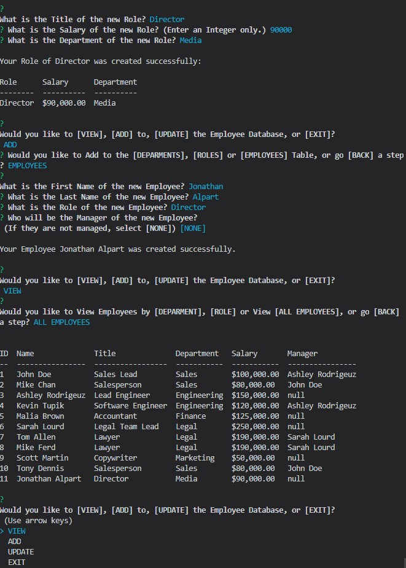

# Employee-Tracker
Built for managing a company's employees, to view and manage the departments, roles, and employees in a company to organize and plan a business, this command-line application that allows the user to:<br>
* Add departments, roles, employees<br>
* View departments, roles, employees<br>
* Update employee roles<br>

## Installation 
```npm install```<br>
```npm i asciiart-logo```<br>
```npm i console.table```<br>
```npm i inquirer```<br>
```npm i mysql```<br>
```npm i process```<br>
```npm i util```<br>
```npm i validate```<br>

## Screenshot


## License
This application is under the ISC license.

## How You Can Contribute
This is a course assigment and therefore needs no contribution.
